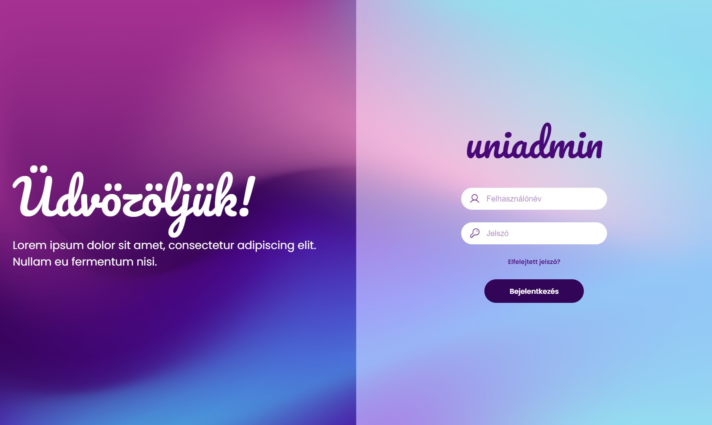
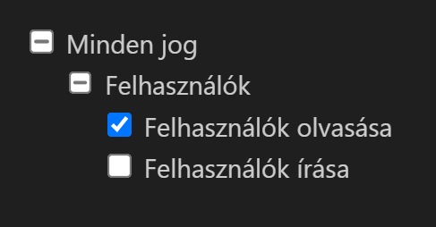

# Uninet Feladatsor - Full-stack

Próbafeladat full-stack jelentkezők számára.

A cél, hogy egy fullstack web applikációt rakj össze a meghatározott eszközökkel, a kritériumok alapján.

Előkészítettünk neked egy docker compose környezetet. Megtalálod benne az adatbázist, az api skeletonját és a frontedn applikáció vue starter projektjét.

A feladatok megoldásához használhatsz bármilyen eszközt, minket is beleértve.\
Szívesen segítünk, ha elakadsz egy problémánál. 🙂

> **Fontos**: Ha a Docker konténerekkel bármi problémád van, jelezd kérlek!

## Feladatok

### 1. Adatbázis

> Az adatbázist a **database** nevű konténerben találod. Találsz benne 3 táblát: **users**, **permissions**, **user_permissions**. Ezeket feltöltöttük alapértelmezett adatokkal, amikkel tudsz dolgozni.

Hozd létre a következő táblát:

- `user_sessions`:
    - `id`: serial8
    - `user_id`: int8
    - `token`: varchar(255)
    - `expires_at` time

### 2. REST API

>Az API kezdetleges verzióját az **api** mappában találod. A keretrendszer a következő: [Phalcon](https://phalcon.io/)
>A meglévő kódok és a Phalcon dokumentáció segítségével írd meg az API-t az alábbi követelményeknek megfelelően!

Hozd létre az alábbi kódstruktúrát!

``` plain
api
└── controllers/
    |-- ...
    ├── AuthController.php/
    │   ├── loginAction
    │   └── logoutAction
    └── UserController.php/
        ├── listAction
        ├── createAction
        ├── readAction
        ├── updateAction
        └── deleteAction
```

A controllers mappában találsz egy `UserController.php`, egy `BaseController.php` és egy `ErrorController.php` nevű fájlt.

A `UserController`-ben van egy `listAction` nevű függvény, ezt a `http://localhost:8680/user/list` címen éred el.
A router alapértelmezett módban van, ez azt jelenti, hogy a /:controllerName/:actionName formátummal tudod elérni.

A `BaseController` tartalmaz egy `routeGuard` függvényt, ami paraméterként a szükséges jogot kapja, és ha a bejelentkezett felhasználónak nincs jogosultsága vagy nincs érvényes `session`-je, akkor dobja át az `ErrorController` megfelelő action-jeire!

> **Fontos**
>
> - Az autentikációs tokent http headerben kommunikálja le a kliens a szerverrel!
> - A `users` tábla jelszó mezőjében található (jelenleg plain text) jelszavakat tárold [Argon2i](https://docs.phalcon.io/5.8/encryption-security/#argon2i) hashként!

> **Hasznos linkek**
>
> - [Phalcon router](https://docs.phalcon.io/5.8/routing/#routing-component)
> - [Phalcon controller events](https://docs.phalcon.io/5.8/controllers/#events)
> - [Phalcon request](https://docs.phalcon.io/5.8/request/#request-component)
> - [Phalcon response](https://docs.phalcon.io/5.8/response/#response-component)

### 3. Frontend app

> Az **app** mappában egy újonnan létrehozott Vue3 projektet találsz. Ezt módosítsd következő igények szerint!

Az alábbi kép alapján készítsd el a bejelentkező felületet!



> **Fontos:** Nem szükséges pixel precizitás, de számít a css!\
Az elfelejtett jelszó funkciót nem szükséges implementálni.

Sikeres bejelentkezés esetén a felhasználók listájára navigáljon át a felület ami legyen dashboard elrendezésű!

> A felhasználólista nézet és a dashboard elrendezés stlílusát rád bízzuk. 🙂

Az oldal jobb felső részére tegyél egy kijelentkezés gombot!

A felhasználók aloldalon legyen egy szűrő, amiben a lekért userek között lehet keresni név és email cím alapján.
A táblázat tartalmazza a felhasználók következő adatait: `név`, `email`, `jogosultságok listája`.

A műveletek oszlopban minden sorban lennie kell egy gombnak, amire kattintva egy modal ugrik fel a kiválasztott user adataival. Az adatokat lehet módosítani majd menteni, vagy éppen a felhasználót törölni (soft delete). Természetesen csak annak a usernek akinek van jogosultsága hozzá.

> A modalban legyen egy jogosultság szerkesztő fa struktúra az alábbi screenshothoz hasonlóan.\

